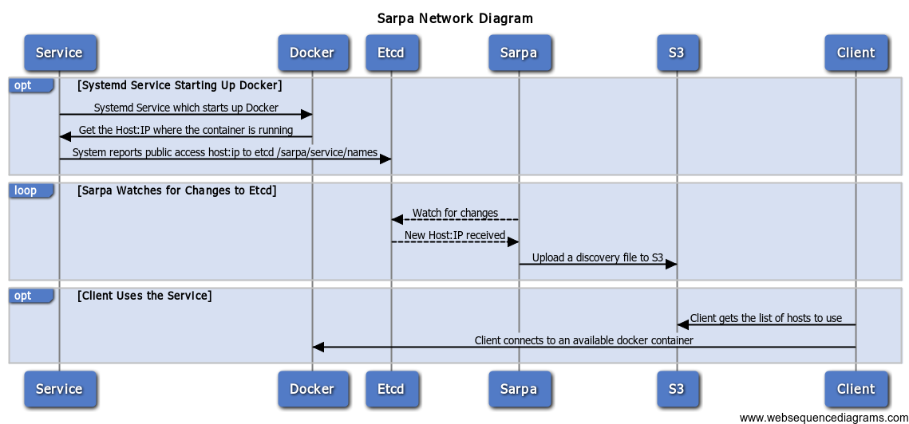

[](https://godoc.org/github.com/abhiyerra/sarpa/client)

# Sarpa

Sarpa is a poor man's service discovery system. It is made to be used
with Docker instances. So when an Docker instance is started up it
reports itself on etcd with the public ip and port to connect
to. Sarpa watches for these key changes. And updates a file in S3
which has key values of service to machines.

# Running

    export AWS_ACCESS_KEY_ID=<your access key id>
    export AWS_SECRET_ACCESS_KEY=<your secret key>
    export ETCD_HOSTS="http://127.0.0.1:4001"
    export SARPA_BUCKET="discovery.forestly.org"
    ./sarpa

# Etcd Keys

The keys for the discovery looks like the following. It always looks
in the /sarpa directory. The next key is the s3 bucket to push the
configuration file to. The value after that is the service short name.

In that directory you can create children which include the public_host:port
so the clients can connect to them.

    /sarpa/:service/:machine_id

Example:

    etcdctl set /sarpa/treely/1 "http://1.2.3.4:3001"

# Example of a service reporting to sarpa

Here is a an example for treemap. It is a fleet script which runs the
service on a CoreOS cluster.

    [Unit]
    Description=treemap

    [Service]
    ExecStartPre=-/usr/bin/docker pull forestly/treely
    ExecStartPre=-/usr/bin/docker kill treemap-%i
    ExecStartPre=-/usr/bin/docker rm treemap-%i
    ExecStart=/usr/bin/docker run --rm --name treemap-%i -p 3001:3001 forestly/treely
    ExecStartPost=/usr/bin/etcdctl set /sarpa/treemap/%m http://%H:3001
    ExecStop=/usr/bin/docker stop treemap-%i
    ExecStopPost=/usr/bin/etcdctl rm /sarpa/treemap/%m

    [X-Fleet]
    Conflicts=treemap@*.service

# Usage in Javascript

```javascript
<script src="http://youbucket.aws.com/discovery.js"></script>
<script>
   console.log(SarpaServiceDiscovery);
</script>
```

# Network Diagram

